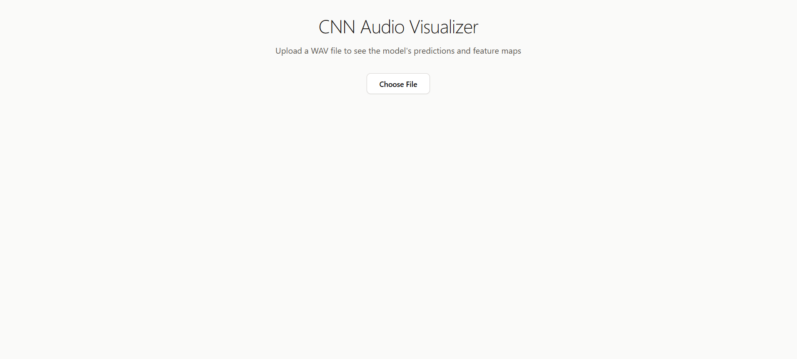
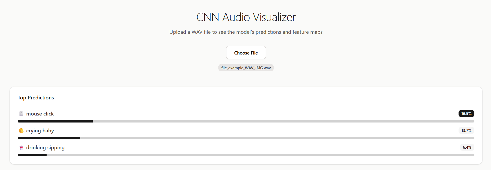
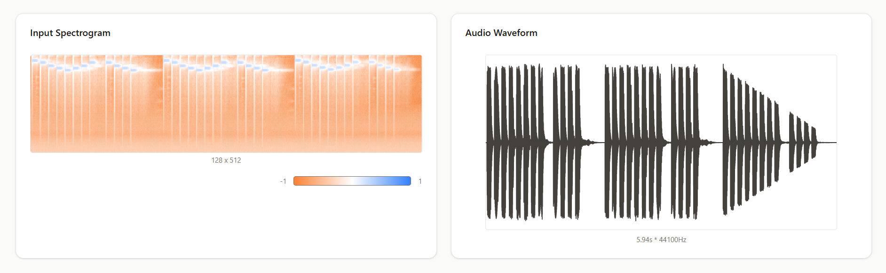
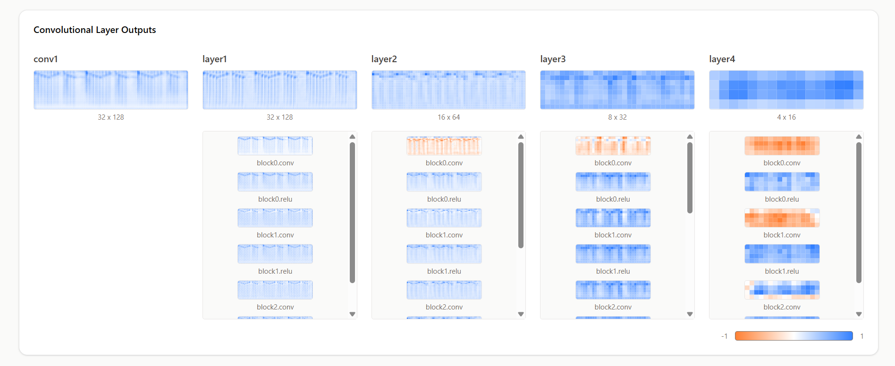

# Deep Audio CNN - Deep Learning Sound Classification



> A complete end-to-end audio classification system built with PyTorch, featuring a ResNet-style CNN architecture, interactive web dashboard, and serverless GPU inference.

## 🎯 Overview

This project implements a state-of-the-art audio classification system that can identify and classify various sounds such as dog barking, birds chirping, and other environmental audio. The system combines advanced deep learning techniques with a modern web interface for real-time audio analysis and visualization.

## 📸 Project Screenshots

### Predictions


### Spectrogram View


### Convolutional Layer Outputs


## ✨ Key Features

### 🧠 **Deep Learning Architecture**
- **ResNet-style CNN**: Advanced residual network architecture for robust feature extraction
- **Mel Spectrogram Processing**: Converts audio signals to visual spectrograms for CNN processing
- **Batch Normalization**: Ensures stable and fast training convergence

### 🎛️ **Advanced Training Pipeline**
- **Data Augmentation**: Mixup and Time/Frequency Masking for improved generalization
- **Optimized Training**: AdamW optimizer with OneCycleLR scheduler
- **TensorBoard Integration**: Comprehensive training analysis and visualization
- **GPU Acceleration**: Efficient training on CUDA-enabled devices

### ⚡ **Serverless Deployment**
- **Modal Integration**: Serverless GPU inference for scalable predictions
- **FastAPI Backend**: High-performance API endpoints for audio processing
- **Pydantic Validation**: Robust data validation for API requests

### 📊 **Interactive Web Dashboard**
- **Next.js & React**: Modern, responsive web interface
- **Real-time Classification**: Upload audio files and get instant predictions
- **Confidence Scores**: Detailed probability distributions for each class
- **Waveform Visualization**: Interactive audio waveform display
- **Feature Map Exploration**: Visualize internal CNN representations

### 🎨 **Modern UI/UX**
- **Tailwind CSS**: Clean, modern styling
- **Shadcn UI Components**: Professional component library
- **Responsive Design**: Works seamlessly across all devices

## 🏗️ Architecture

```
┌─────────────────┐    ┌──────────────────┐    ┌─────────────────┐
│   Audio Input   │───▶│  Mel Spectrogram │───▶│   ResNet CNN    │
│   (.wav, .mp3)  │    │   Preprocessing  │    │  Classification │
└─────────────────┘    └──────────────────┘    └─────────────────┘
                                                         │
┌─────────────────┐    ┌──────────────────┐             │
│  Web Dashboard  │◀───│   FastAPI        │◀────────────┘
│  (Next.js)      │    │   Backend        │
└─────────────────┘    └──────────────────┘
```

## 🚀 Quick Start

### Prerequisites
- Python 3.12+
- Node.js 18+
- CUDA-compatible GPU (recommended)

### 1. Clone Repository
```bash
git clone https://github.com/akasewang/deep-audio-cnn.git
cd deep-audio-cnn
```

### 2. Backend Setup
```bash
cd server

# Create virtual environment
python -m venv venv
source venv/bin/activate  # On Windows: venv\Scripts\activate

# Install dependencies
pip install -r requirements.txt

# Setup Modal for serverless deployment
modal setup

# Run locally for development
modal run main.py

# Deploy to production
modal deploy main.py
```

### 3. Frontend Setup
```bash
cd deep-audio-cnn

cd client

# Install dependencies
npm install

# Start development server
npm run dev
```

### 4. Open Application
Navigate to `http://localhost:3000` to access the web dashboard.

## 📋 Requirements

### Backend Dependencies
```
torch>=2.0.0
torchaudio>=2.0.0
torchvision>=0.15.0
fastapi>=0.100.0
modal>=0.50.0
librosa>=0.10.0
numpy>=1.24.0
pandas>=2.0.0
matplotlib>=3.7.0
seaborn>=0.12.0
tensorboard>=2.13.0
pydantic>=2.0.0
uvicorn>=0.22.0
```

### Frontend Dependencies
```json
{
  "next": "^14.0.0",
  "react": "^18.0.0",
  "tailwindcss": "^3.3.0",
  "@shadcn/ui": "latest",
  "recharts": "^2.8.0"
}
```

## 🎓 Learning Resources

This project covers advanced concepts in:
- **Deep Learning**: CNN architectures, residual connections, batch normalization
- **Audio Processing**: Mel spectrograms, STFT, audio augmentation techniques
- **MLOps**: Model deployment, serverless inference, API design
- **Full-Stack Development**: React, Next.js, FastAPI integration
- **Data Science**: Training pipelines, visualization, model interpretability

## 🛠️ Technical Details

### Model Architecture
- **Input**: Mel spectrogram (128 mel bins, variable time steps)
- **Architecture**: ResNet-inspired CNN with skip connections
- **Output**: Multi-class probability distribution
- **Loss Function**: Cross-entropy with label smoothing
- **Optimizer**: AdamW with weight decay

### Data Augmentation
- **Mixup**: Blends audio samples for improved generalization
- **Time Masking**: Random time-domain masking
- **Frequency Masking**: Random frequency-domain masking
- **Noise Injection**: Gaussian noise for robustness

### Performance Metrics
- **Accuracy**: Overall classification accuracy
- **F1-Score**: Weighted F1 across all classes
- **Confusion Matrix**: Detailed per-class performance
- **Inference Speed**: Real-time classification capability

## 🤝 Contributing

Contributions are welcome! Please feel free to submit issues and enhancement requests.

1. Fork the repository
2. Create a feature branch (`git checkout -b feature/amazing-feature`)
3. Commit your changes (`git commit -m 'Add amazing feature'`)
4. Push to the branch (`git push origin feature/amazing-feature`)
5. Open a Pull Request

## 📄 License

This project is licensed under the MIT License - see the [LICENSE](LICENSE) file for details.

## 🙏 Acknowledgments

- PyTorch team for the excellent deep learning framework
- Modal for serverless GPU infrastructure
- Vercel for frontend hosting
- The open-source community for inspiration and resources

---

<div align="center">
  <strong>⭐ Star this repository if you found it helpful!</strong>
</div>
